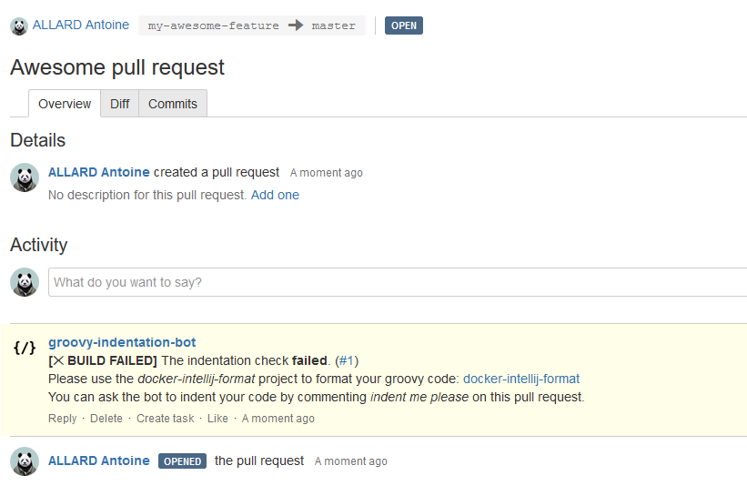
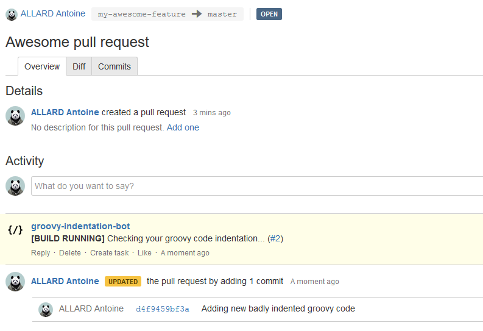
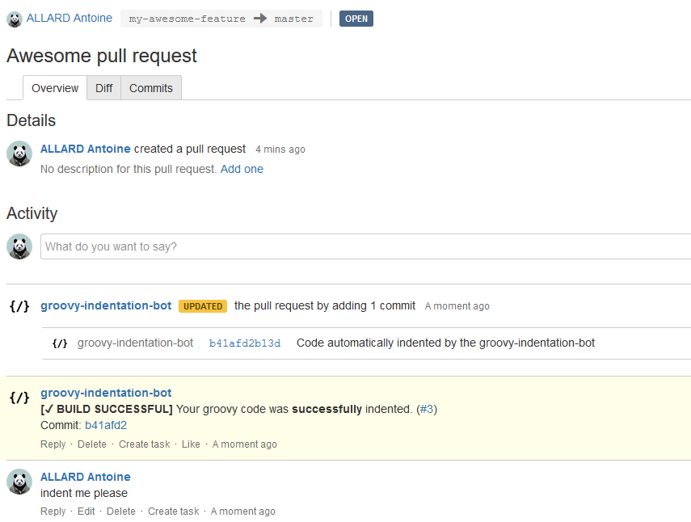

# groovy-indentation-bot

This bot analyses the groovy code indentation of a pull request on bitbucket.

The bot is provided as a service, all you need it to configure it in your bitbucket repo.

## Usage

Once the bot is configured in your bitbucket repository, any new pull request in this repository will trigger the bot.

The bot is triggered when:
- a pull request is created
- a pull request is updated

The bot verifies the indentation of the commits based on the default code style settings of the [docker-intellij-format](https://github.com/aallrd/docker-intellij-format) formatter.

> 

> 

The bot can also apply the formatter for you on the code if you ask it by commenting _indent me please_ on the pull request:

> 

## Configuring the bot

### Requirements

You ideally need a bitbucket bot user for your team. This is the user that you will use to install the bot in your bitbucket repo using the _manage-bitbucket-bot.sh_ script.

It prevents you from using your own bitbucket account and feed its password to the _manage-bitbucket-bot.sh_ script.

### Adding the bot to your repo

In order to configure the bot in your repo, run the _manage-bitbucket-bot.sh_ script.


```
$ ./manage-bitbucket-bot.sh --help
__________.__  __ ___.                  __           __    ___.           __
\______   \__|/  |\_ |__  __ __   ____ |  | __ _____/  |_  \_ |__   _____/  |_
 |    |  _/  \   __\ __ \|  |  \_/ ___\|  |/ // __ \   __\  | __ \ /  _ \   __\
 |    |   \  ||  | | \_\ \  |  /\  \___|    <\  ___/|  |    | \_\ (  <_> )  |
 |______  /__||__| |___  /____/  \___  >__|_ \\___  >__|    |___  /\____/|__|
        \/             \/            \/     \/    \/            \/
---------------------------------------------------------------------------
Usage: manage-bitbucket-bot.sh [OPTIONS]
-----[ OPTIONS ]-----------------------------------------------------------
          -h|--help            : Print this helper.
-----{ Settings }----------------------------------------------------------
          -p|--project         : The name of the bitbucket project containing the repo to configure.
                                 Example: TEAM
          -r|--repo            : The name of the bitbucket repo to configure with the bot.
                                 Example: my-repo
          -u|--user            : The bitbucket username with the admin right on the repo to configure.
                                 Example: team-bitbucket-bot
-----{ Actions }-----------------------------------------------------------
          --add                : Register the bot on the bitbucket repo.
          --delete             : Delete the bot from the bitbucket repo.
---------------------------------------------------------------------------
Report bugs to github.com/aallrd/bitbucket-groovy-indentation-bot
---------------------------------------------------------------------------
```

Running the _manage-bitbucket-bot.sh_ script produces the below output:

```
$ ./manage-bitbucket-bot.sh --project TEAM --repo my-awesome-project --user team-bitbucket-bot --add
__________.__  __ ___.                  __           __    ___.           __
\______   \__|/  |\_ |__  __ __   ____ |  | __ _____/  |_  \_ |__   _____/  |_
 |    |  _/  \   __\ __ \|  |  \_/ ___\|  |/ // __ \   __\  | __ \ /  _ \   __\
 |    |   \  ||  | | \_\ \  |  /\  \___|    <\  ___/|  |    | \_\ (  <_> )  |
 |______  /__||__| |___  /____/  \___  >__|_ \\___  >__|    |___  /\____/|__|
        \/             \/            \/     \/    \/            \/
[INFO] [14:42:10] Targeted bitbucket project: [TEAM]
[INFO] [14:42:10] Targeted bitbucket repo: [my-awesome-project]
[INFO] [14:42:10] Login on bitbucket as user [team-bitbucket-bot]...
team-bitbucket-bot's password:
[INFO] [14:42:15] Registering [groovy-indentation-bot] on the repo [my-awesome-project]...
[SUCCESS] [14:42:16] The bot [groovy-indentation-bot] was successfully registered on the repo [my-awesome-project].
[INFO] [14:42:16] You can access the bot configuration from bitbucket: https://bitbucket.company.com/plugins/servlet/prnfb/admin/TEAM/my-awesome-project
```

### Common issues

- _The projet/repo/user [xxx] does not seem to exist on bitbucket._

Some of the _manage-bitbucket-bot.sh_ script input parameters do not exist on your bitbucket instance, check for a typo mistake.

- _The user [xxx] is not admin on the repo_

The *--user* used in the _manage-bitbucket-bot.sh_ call is not admin in the targeted repo.

If this is your team's bitbucket bot user (as advised), you need to add it to the *User access* list in your repo (https://bitbucket.company.com/projects/PROJECT/repos/REPO/permissions).

You need to make sure that the bot user as the admin permission on this repo.

- _The bot [xxx] is already registered on the repo [yyy]_

The tool detected that the bot [xxx] you are trying to set is already configured in the targeted repo [yyy].

Please check in the **Pull request notifications** menu under the *Add-Ons* section of the targeted repo that the bot is indeed already configured and delete it if need be.

## Further documentation

This bot is using the [pull-request-notifier-for-bitbucket](https://github.com/tomasbjerre/pull-request-notifier-for-bitbucket) plugin.

This plugin is installed on our company Bitbucket instance and is available to every users.

The plugin **Pull request notifications** menu can be found in your repo settings under the *Add-Ons* section.

You can list the bots configured in the *Notification* drop down list, selecting a configuration will load all the bot parameters.

The documentation of the plugin is quite good, with a lot of examples:

- The README is a goldmine: [README](https://github.com/tomasbjerre/pull-request-notifier-for-bitbucket)
- The Jenkins section shows how to call a Jenkins job: [Jenkins](https://github.com/tomasbjerre/pull-request-notifier-for-bitbucket/blob/master/README_jenkins.md)
- Inspiration from another plugin using this notifier: [Violation Comments to Bitbucket Server](https://github.com/jenkinsci/violation-comments-to-bitbucket-plugin)

## Support

For any support request, please open an issue or a PR.
